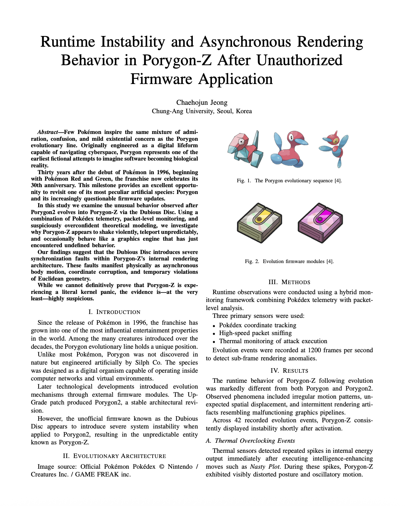

# PolygonZ
Runtime Instability and Asynchronous Rendering Behavior in Porygon-Z After Unauthorized Firmware Application

# Firmware-Driven Evolution: A Systems Analysis of the Porygon Line

This repository contains the LaTeX source and compiled paper for our submission to **SIGBOVIK**.

The paper humorously analyzes the evolution of the Pokémon Porygon line (Porygon → Porygon2 → Porygon-Z) through the lens of software engineering and firmware updates.

---

## Paper Preview

---

## PDF

You can read the full paper here:

📄 **[Download the PDF](porygonz_jeong.pdf)**

---

## Abstract

Porygon is one of the few Pokémon that evolves not through biology, but through software updates.  
In this work we interpret the evolution from Porygon to Porygon2 and ultimately Porygon-Z as a sequence of firmware upgrades.  
While the Up-Grade item appears to introduce a stable system update, the Dubious Disc results in noticeable instability, suggesting the installation of experimental—or possibly corrupted—code.  
By viewing Pokémon evolution as a form of version control, we humorously explore how the final update can make a system more interesting, but not necessarily more stable.

